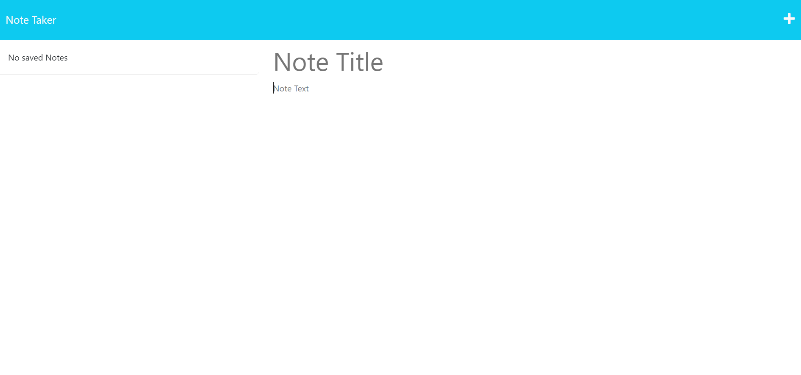
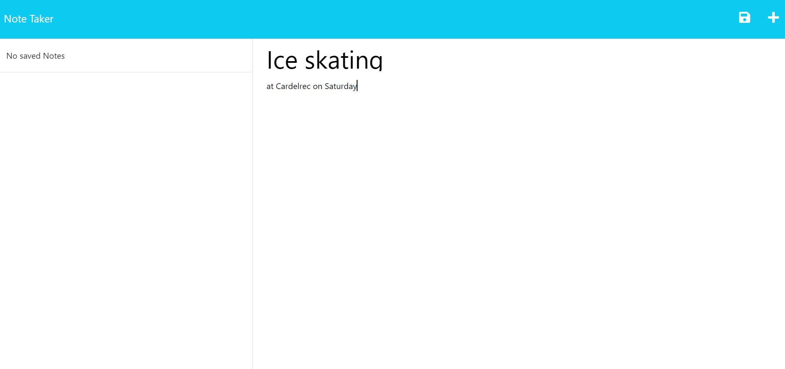
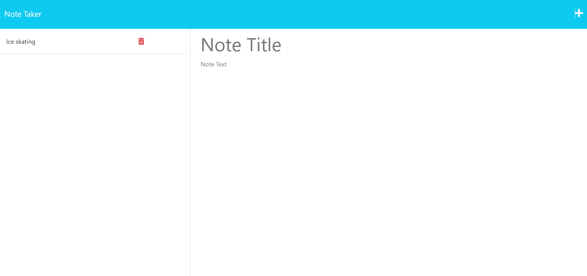
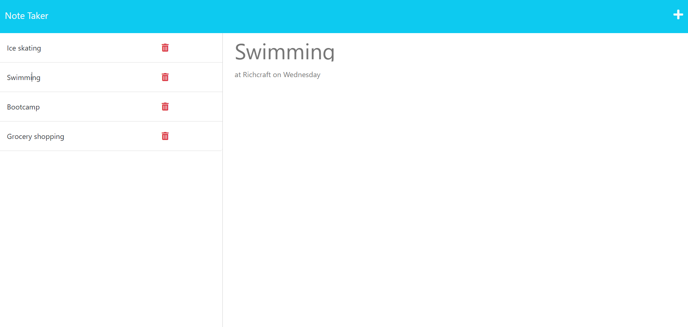
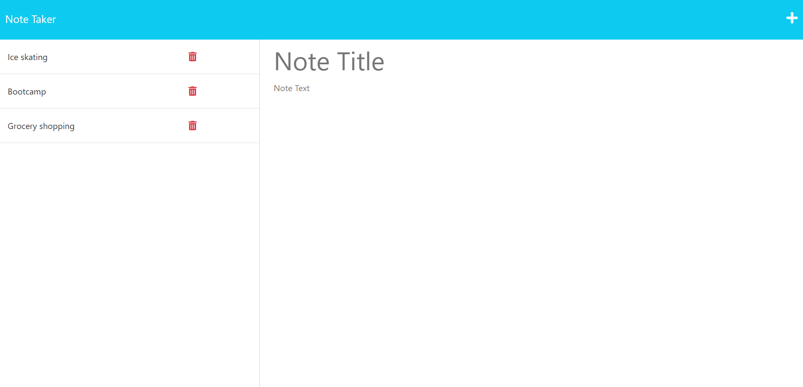

# Note Taker

## Description
This is a very useful application that can be used to create and delete notes.

## Installation
Run "npm install" before running the application by typing "node server.js".

## Usage
After opening the app in the browser, click on Get Started button.  
The notes page will open. There you can add and delete notes.

To use the Note-Taker you can click on the link below:
[Note Taker - Sonja Gorin](https://murmuring-beyond-80827-82186790f589.herokuapp.com/)

Preview:

## License
Please refer to the LICENSE in the repo.
